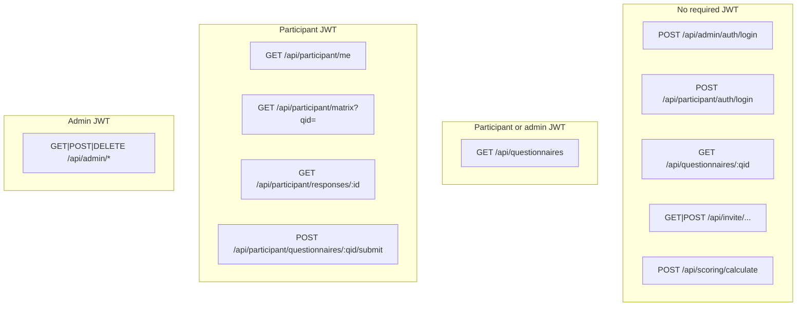

# Application routes and API map

This document maps **SPA routes**, **REST endpoints**, and **auth boundaries** as implemented in the repository. It is intended as a living reference; when behaviour changes, update this file.

## API prefix

NestJS registers a global prefix so all HTTP routes are served under **`/api`**. See [`applications/backend/src/main.ts`](../../applications/backend/src/main.ts).

The frontend Axios clients use `baseURL: '/api'` (see [`applications/frontend/src/api/client.ts`](../../applications/frontend/src/api/client.ts) and [`applications/frontend/src/api/participantClient.ts`](../../applications/frontend/src/api/participantClient.ts)).

## Roles and JWT

The shared Passport JWT strategy validates tokens and builds [`JwtValidatedUser`](../../applications/backend/src/presentation/admin/jwt.strategy.ts):

| Role | Meaning | Guards |
|------|---------|--------|
| `admin` | Back-office operator | [`AdminJwtAuthGuard`](../../applications/backend/src/presentation/admin/admin-jwt-auth.guard.ts) |
| `participant` | End user completing questionnaires | [`ParticipantJwtAuthGuard`](../../applications/backend/src/presentation/participant/participant-jwt-auth.guard.ts) |

There is **no** separate “super admin” role in the codebase today: only `admin` and `participant` are distinguished on the JWT payload.

### Token storage (frontend)

| Actor | Module | HTTP client |
|-------|--------|-------------|
| Admin | [`applications/frontend/src/lib/auth.ts`](../../applications/frontend/src/lib/auth.ts) | [`apiClient`](../../applications/frontend/src/api/client.ts) |
| Participant | [`auth.ts`](../../applications/frontend/src/lib/auth.ts) (`participantAuth`) | [`participantApiClient`](../../applications/frontend/src/api/participantClient.ts) |

## SPA routes (TanStack Router)

Route modules live under [`applications/frontend/src/routes/`](../../applications/frontend/src/routes/).

### Participant-facing

| Path | Auth | Source |
|------|------|--------|
| `/` | Participant JWT required (`beforeLoad` → `/login`) | [`index.tsx`](../../applications/frontend/src/routes/index.tsx) |
| `/login` | Public; redirect if already authenticated | [`login.tsx`](../../applications/frontend/src/routes/login.tsx) |
| `/forgot-password` | Public (placeholder) | [`forgot-password.tsx`](../../applications/frontend/src/routes/forgot-password.tsx) |
| `/questionnaire/$qid` | Participant JWT | [`questionnaire.$qid.tsx`](../../applications/frontend/src/routes/questionnaire.$qid.tsx) |
| `/results/$qid/$responseId` | Participant JWT | [`results.$qid.$responseId.tsx`](../../applications/frontend/src/routes/results.$qid.$responseId.tsx) |
| `/invite/$token` | Public (invitation link flow) | [`invite.$token.tsx`](../../applications/frontend/src/routes/invite.$token.tsx) |

### Admin

Layout and guard: [`admin/route.tsx`](../../applications/frontend/src/routes/admin/route.tsx) — unauthenticated users are sent to `/admin/login` except on that path.

| Path | Notes |
|------|--------|
| `/admin/login` | No sidebar |
| `/admin/` | Dashboard |
| `/admin/responses` | Responses list |
| `/admin/companies` | Companies |
| `/admin/participants` | Participants |
| `/admin/participants/$participantId/matrix` | Per-participant matrix |

## REST API by surface

Unless noted, paths are relative to **`/api`**.

### No participant/admin JWT required (public or login)

| Method | Path | Controller |
|--------|------|------------|
| `POST` | `/admin/auth/login` | [`AdminController`](../../applications/backend/src/presentation/admin/admin.controller.ts) |
| `POST` | `/participant/auth/login` | [`ParticipantController`](../../applications/backend/src/presentation/participant/participant.controller.ts) |
| `GET` | `/questionnaires/:qid` | [`QuestionnairesController`](../../applications/backend/src/presentation/questionnaires/questionnaires.controller.ts) (detail is public for invite/onboarding flows) |
| `GET` | `/invite/:token` | [`PublicInvitesController`](../../applications/backend/src/presentation/invitations/invitations-public.controller.ts) |
| `POST` | `/invite/:token/activate` | Same |
| `POST` | `/invite/:token/submit` | Same |
| `POST` | `/scoring/calculate` | [`ScoringController`](../../applications/backend/src/presentation/scoring/scoring.controller.ts) — **no auth guard** on this handler today |

### Participant or admin JWT (`GET /questionnaires` list only)

| Method | Path | Controller |
|--------|------|------------|
| `GET` | `/questionnaires` | [`QuestionnairesController`](../../applications/backend/src/presentation/questionnaires/questionnaires.controller.ts) — [`AdminOrParticipantJwtAuthGuard`](../../applications/backend/src/presentation/admin-or-participant-jwt-auth.guard.ts) |

### Participant JWT (`Bearer` + `role: participant`)

| Method | Path | Controller |
|--------|------|------------|
| `GET` | `/participant/me` | [`ParticipantController`](../../applications/backend/src/presentation/participant/participant.controller.ts) — profil et `assigned_questionnaire_ids` (questionnaires distincts présents sur les jetons d’invitation) |
| `GET` | `/participant/matrix?qid=` | Same — `qid` optionnel si un seul questionnaire assigné ; sinon doit être l’un des ids autorisés — même DTO matrice qu’en admin ([ADR-001](../adr/ADR-001-user-facing-questionnaires-matrix-api.md)) |
| `GET` | `/participant/responses/:responseId` | Same |
| `POST` | `/participant/questionnaires/:qid/submit` | Same — refus si `qid` ≠ questionnaire assigné lorsqu’un assigné est connu |

### Admin JWT (`Bearer` + `role: admin`)

All routes on [`AdminManagementController`](../../applications/backend/src/presentation/admin/admin-management.controller.ts) are protected by `@UseGuards(AdminJwtAuthGuard)` at class level.

| Method | Path |
|--------|------|
| `GET` | `/admin/dashboard` |
| `GET` | `/admin/responses` |
| `GET` | `/admin/responses/:responseId` |
| `DELETE` | `/admin/responses/:responseId` |
| `GET` | `/admin/participants` |
| `POST` | `/admin/participants/import` |
| `POST` | `/admin/participants/:participantId/invite` |
| `GET` | `/admin/participants/:participantId/tokens` |
| `GET` | `/admin/participants/:participantId/matrix` |
| `DELETE` | `/admin/participants/:participantId` |
| `GET` | `/admin/mail/status` |
| `GET` | `/admin/companies` |
| `GET` | `/admin/export/responses` |
| `GET` | `/admin/export/responses/anonymized` |
| `GET` | `/admin/cutover-strategy` |

## Frontend API modules (which client calls which)

| Module | Client | Typical endpoints |
|--------|--------|-------------------|
| [`admin.ts`](../../applications/frontend/src/api/admin.ts) | `apiClient` | `/admin/*` (after login) |
| [`participantAuth.ts`](../../applications/frontend/src/api/participantAuth.ts) (hooks) | `participantApiClient` | `/participant/auth/login` |
| [`participantSession.ts`](../../applications/frontend/src/api/participantSession.ts) | `participantApiClient` | `/participant/me`, `/participant/matrix` |
| [`questionnaires.ts`](../../applications/frontend/src/api/questionnaires.ts) | `participantApiClient` + `apiClient` | List: `useQuestionnaires` (participant) / `useAdminQuestionnaires` (admin); detail: public `apiClient` |
| [`responses.ts`](../../applications/frontend/src/api/responses.ts) | `participantApiClient` | `/participant/responses/:id` |
| [`invitations.ts`](../../applications/frontend/src/api/invitations.ts) | `apiClient` (no admin token required) | `/invite/:token`, `/activate`, `/submit` |
| [`downloads.ts`](../../applications/frontend/src/api/downloads.ts) | `apiClient` | Admin CSV exports (`downloadAdminBlob`) |

Interceptor behaviour: see [`client.ts`](../../applications/frontend/src/api/client.ts) (401 under `/admin` → admin logout) and [`participantClient.ts`](../../applications/frontend/src/api/participantClient.ts) (401 outside admin → participant logout).

## High-level diagram

## Related documentation

- Backend overview: [`applications/backend/README.md`](../../applications/backend/README.md)
- Example ADR for matrix API: [`docs/adr/ADR-001-user-facing-questionnaires-matrix-api.md`](../adr/ADR-001-user-facing-questionnaires-matrix-api.md)
- Participant invites → `assigned_questionnaire_ids`, matrix `qid`, home UI: [`docs/architecture/participant-invite-questionnaires-and-session-ui.md`](./participant-invite-questionnaires-and-session-ui.md)
